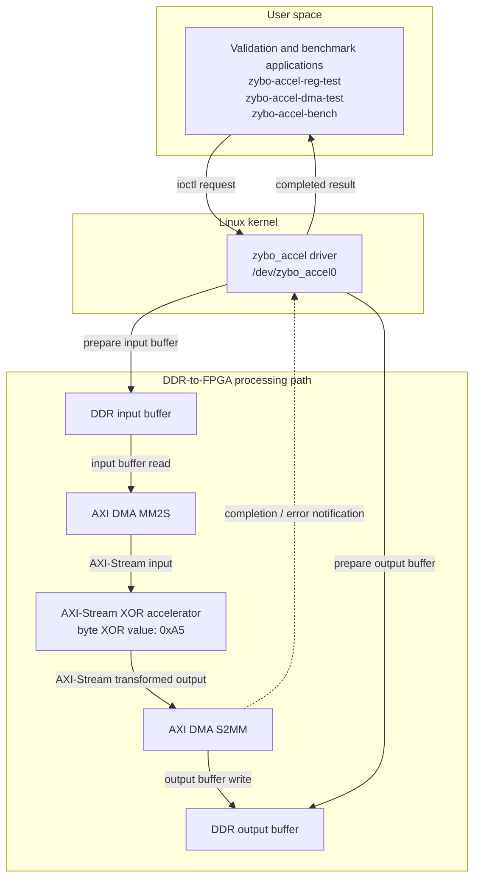
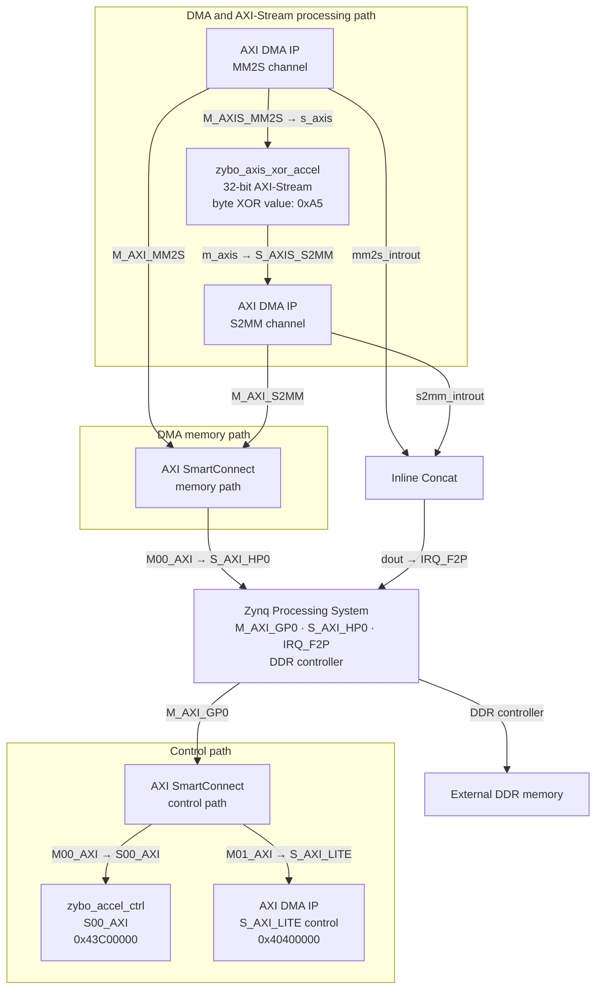

# Architecture

## 1. Purpose and current scope

This project implements a Linux-controlled FPGA data-processing platform on the Digilent Zybo Z7-20.

Linux runs on the Zynq processing system. A user-space program prepares an input buffer and submits it through a custom Linux kernel driver. The driver coordinates DMA-based transfer through programmable logic, receives the processed output, and returns it to software for verification or measurement.

The current programmable-logic accelerator performs a fixed byte-wise XOR transformation with `0xA5`. This transformation is intentionally simple and deterministic. It provides a clear way to verify that the full Linux-to-FPGA processing path works before replacing the validation logic with a more application-specific accelerator later.

The current implementation proves:

- controlled Linux access to FPGA registers,
- driver-managed DMA buffer transactions,
- custom AXI-Stream processing in programmable logic,
- software-side correctness verification,
- a reusable platform structure for later accelerator work.

---

## 2. Target platform

| Item | Current target |
|---|---|
| Board | Digilent Zybo Z7-20 |
| SoC | Xilinx Zynq-7020 |
| Hardware design tool | Vivado 2025.2 |
| Linux build tool | PetaLinux 2025.2 |

---

## 3. Responsibility split

The system is divided into four main roles.

### 3.1 User-space software

User-space programs:

- prepare test or benchmark input buffers,
- submit requests through the driver,
- receive processed output,
- verify correctness,
- report validation or measurement results.

### 3.2 Linux kernel driver

The custom driver exposes:

```text
/dev/zybo_accel0
```

The driver:

- owns the public software interface to the accelerator platform,
- accesses the custom FPGA control registers,
- acquires the DMA channels,
- prepares DMA transactions,
- waits for completion,
- reports timeout, error, and statistics information.

### 3.3 Programmable logic

The programmable-logic design contains:

- a custom AXI-Lite control block,
- AXI DMA,
- a custom AXI-Stream XOR accelerator,
- the required interconnect, reset, and interrupt support logic.

### 3.4 DDR-backed transfer memory

Input and output buffers reside in DDR memory. AXI DMA reads input data from DDR, streams it through the FPGA accelerator, and writes the transformed output back to DDR.

---

## 4. System-level architecture



This diagram separates the system by responsibility:

- user-space applications submit work, validate returned data, and report benchmark results,
- the kernel driver owns the controlled software interface to the accelerator platform,
- AXI DMA moves buffers between DDR memory and the programmable-logic stream path,
- the FPGA accelerator performs the current byte-wise XOR transformation,
- the transformed output is returned to software through the driver-controlled transaction path.

The diagram describes the logical transaction flow. It does not show the detailed Vivado block-design wiring; that hardware topology is shown separately below.

---

## 5. End-to-end transaction model

A normal transformed-buffer transaction works as follows:

1. A user-space application opens `/dev/zybo_accel0`.
2. The application submits an input/output request through the driver.
3. The driver validates the request.
4. The driver prepares DMA-safe input and output buffers.
5. The driver prepares the receive path first, then starts the transmit path.
6. AXI DMA reads the input buffer from DDR and streams it into programmable logic.
7. The XOR accelerator transforms every payload byte with `0xA5`.
8. AXI DMA writes the transformed output stream back to DDR.
9. The driver waits for completion or reports a timeout/error.
10. The completed output is returned to user space.
11. The application compares the output against a software XOR reference.

This is the central verified behavior of the current system.

---

## 6. Hardware/IP-level architecture

The implemented Vivado design contains two distinct paths:

- a **control path** used for software-visible register access and AXI DMA control,
- a **data path** used for DMA buffer movement through the custom XOR accelerator.



The control path lets Linux reach:

- the custom `zybo_accel_ctrl` AXI-Lite register block at `0x43C00000`,
- the AXI DMA control interface at `0x40400000`.

The data path works independently of that register-control path:

- AXI DMA reads input buffers from DDR through its MM2S memory-side interface,
- the stream passes through `zybo_axis_xor_accel`,
- AXI DMA writes the transformed stream back to DDR through its S2MM memory-side interface.

The memory-side DMA ports reach DDR through the dedicated memory-path SmartConnect and the Zynq PS `S_AXI_HP0` interface.

The DMA interrupt outputs are combined through Inline Concat before reaching the Zynq PS fabric interrupt input `IRQ_F2P`.

Clock and reset support for this block design is shared across the programmable-logic path:

- `FCLK_CLK0` clocks the control path, memory path, AXI DMA interfaces, the custom AXI-Lite block, the XOR accelerator, and the PS `S_AXI_HP0` interface clock input.
- `FCLK_RESET0_N` feeds Processor System Reset.
- `interconnect_aresetn` resets the two SmartConnect blocks.
- `peripheral_aresetn` resets the custom AXI-Lite block, AXI DMA, and the XOR accelerator.

---

## 7. Implemented hardware blocks

| Block | Role |
|---|---|
| Zynq Processing System | Runs Linux, controls DDR, provides AXI master/control access, high-performance DDR access, and fabric interrupt input |
| Control-path SmartConnect | Routes the PS control path to the custom AXI-Lite block and AXI DMA control interface |
| `zybo_accel_ctrl` | Custom AXI-Lite register block for software-visible hardware identification and regression access |
| AXI DMA | Moves input and output buffers between DDR and the programmable-logic stream path |
| Memory-path SmartConnect | Connects AXI DMA memory-side traffic to the PS DDR access path |
| `zybo_axis_xor_accel` | Custom 32-bit AXI-Stream fixed-XOR accelerator |
| Processor System Reset | Generates synchronized reset distribution for programmable-logic blocks |
| Inline Concat | Combines DMA interrupt outputs before they enter the PS interrupt input |

---

## 8. Control interface

### 8.1 Custom AXI-Lite control block

| Property | Value |
|---|---|
| Block name | `zybo_accel_ctrl` |
| Base address | `0x43C00000` |
| Address range | `64 KiB` |

The current public register interface is intentionally minimal:

| Offset | Register | Purpose |
|---|---|---|
| `0x00` | `VERSION` | Fixed hardware-version value |
| `0x04` | `SCRATCH` | Driver-controlled read/write regression register |

Current hardware version:

```text
VERSION = 0x00010000
```

### 8.2 Register purpose

`VERSION` allows software to confirm that the expected hardware revision is present.

`SCRATCH` provides a safe read/write register used to verify that:

- user space reaches the driver,
- the driver reaches the FPGA control block,
- FPGA register reads and writes behave correctly.

---

## 9. DMA and stream-processing path

### 9.1 AXI DMA configuration

| Property | Current implementation |
|---|---|
| Control base address | `0x40400000` |
| DMA mode | Simple DMA |
| Active directions | MM2S and S2MM |
| Stream processing path | 32-bit AXI-Stream |
| Buffer Length Register Width | 21 |

The 21-bit transfer-length configuration supports the current driver policy of transfers up to 1 MiB.

### 9.2 DMA channel ownership

The driver uses the Linux DMAEngine framework rather than exposing AXI DMA registers directly to user space.

The accelerator device-tree node binds to the two DMA channels as:

```dts
dmas = <&axi_dma_0 0>, <&axi_dma_0 1>;
dma-names = "tx", "rx";
```

The names mean:

| Name | DMA direction | Meaning |
|---|---|---|
| `"tx"` | MM2S | memory to stream |
| `"rx"` | S2MM | stream to memory |

This allows the driver to request the exact DMA channels it needs by name.

### 9.3 XOR accelerator behavior

The custom stream accelerator applies:

```text
output_byte = input_byte XOR 0xA5
```

At the 32-bit stream-word level, this corresponds to:

```text
output_word = input_word XOR 0xA5A5A5A5
```

The accelerator preserves:

- payload byte count,
- stream length,
- stream ordering,
- `TKEEP`,
- `TLAST`.

It does not expand, compress, or reorder the transfer.

---

## 10. Linux driver architecture

The project driver is named:

```text
zybo_accel
```

It exposes:

```text
/dev/zybo_accel0
```

The driver is the controlled software boundary between user applications and the FPGA subsystem.

### 10.1 Driver responsibilities

The driver currently:

- binds to the accelerator device-tree node,
- maps the AXI-Lite control register region,
- reads the hardware `VERSION` value,
- implements the `SCRATCH` regression path,
- acquires DMAEngine channels `"tx"` and `"rx"`,
- manages driver-owned DMA staging buffers,
- supports blocking DMA submissions from user space,
- waits for completion,
- reports timeout and transfer errors,
- exposes DMA capability and transaction statistics.

### 10.2 Current execution model

The driver uses a blocking transaction model:

1. user space submits a request,
2. the driver launches the DMA operation,
3. the call returns only after:
   - success,
   - timeout,
   - or error.

This model keeps the current validation path deterministic and easy to test.

---

## 11. User-space applications

The current repository includes three target-side programs.

| Program | Purpose |
|---|---|
| `zybo-accel-reg-test` | Validates `VERSION` and `SCRATCH` access through the kernel driver |
| `zybo-accel-dma-test` | Validates transformed DMA transfers and invalid-request rejection |
| `zybo-accel-bench` | Measures latency, throughput, CPU-usage estimate, timeout count, and error count for the current accelerator path |

### 11.1 Register regression test

`zybo-accel-reg-test` confirms:

- `/dev/zybo_accel0` is usable,
- `VERSION` reports `0x00010000`,
- `SCRATCH` write/readback checks pass.

### 11.2 DMA/XOR validation suite

`zybo-accel-dma-test --suite` validates:

- 8 transfer sizes,
- 5 deterministic data patterns,
- 2 timeout-submission forms,
- 10 repeated runs per positive case,
- 6 invalid-request rejection checks,
- driver statistics behavior,
- XOR output correctness against a software reference.

### 11.3 Benchmark tool

`zybo-accel-bench` measures the current accelerator path and reports:

- latency,
- throughput,
- CPU-usage estimate,
- timeout count,
- error count,
- overall result.

---

## 12. Current verified result

The current architecture has been rebuilt, deployed, and tested on a physical Zybo Z7-20 board.

Verified board-side programs:

- `zybo-accel-reg-test`: PASS,
- `zybo-accel-dma-test --suite`: PASS,
- `zybo-accel-bench`: PASS.

The DMA/XOR validation suite passed with:

- 80 / 80 positive validation cases,
- 800 / 800 transformed DMA transfers,
- 6 / 6 invalid-request checks,
- zero timeouts,
- zero driver-reported errors,
- verified transformed transfers up to 1 MiB.

This confirms that the full current path works:

1. Linux submits a buffer,
2. the driver coordinates DMA,
3. programmable logic transforms the data,
4. DMA returns the output,
5. software verifies the result.

---

## 13. Current implementation boundary

The current system is complete for the present validation milestone, but it is intentionally not the final application-specific accelerator.

Current boundaries:

- The programmable-logic accelerator performs fixed XOR with `0xA5`, not AES.
- The public control-register interface remains intentionally small:
  - `VERSION`
  - `SCRATCH`
- The FPGA processes buffers supplied by Linux.
- Networking protocols are not implemented in programmable logic.
- Linux remains responsible for:
  - buffer preparation,
  - transaction submission,
  - result checking,
  - benchmarking.
- The current software and DMA structure are intended to be reused by later accelerator work.

---

## 14. Extension direction

The current architecture is designed so the programmable-logic processing block can be replaced or extended while preserving the verified Linux, driver, DMA, and validation foundation.

The next major application-specific direction is AES-CTR acceleration.

That later extension is expected to reuse, where practical:

- the Linux-controlled driver model,
- the DMA-based buffer-transfer path,
- the current device-tree DMA relationship,
- the existing validation and benchmark structure.

Future accelerator-specific control and status features should be added only when required by the next implemented hardware stage.
